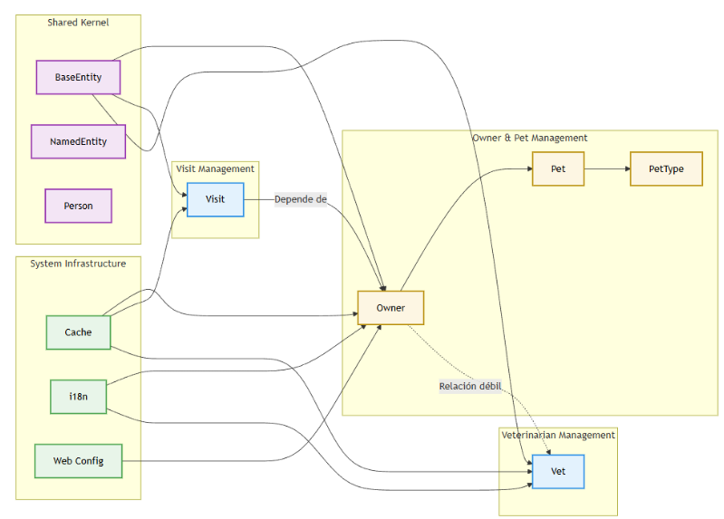

# Spring PetClinic – Monolito Empresarial 2026

[](LICENSE)
[](https://github.com/sandra381/project_enterprise_monolith_2026/actions)
[](https://sonarcloud.io/dashboard?id=sandra381_project_enterprise_monolith_2026)
[](https://sonarcloud.io/dashboard?id=sandra381_project_enterprise_monolith_2026)
[](https://sonarcloud.io/dashboard?id=sandra381_project_enterprise_monolith_2026)
[](#-métricas-dora)

---

## Tabla de Contenidos

- [Descripción del Proyecto](#-descripción-del-proyecto)
- [Características y Mejoras Clave](#-características-y-mejoras-clave)
- [Descripción de la Arquitectura](#-descripción-de-la-arquitectura)
- [Stack Tecnológico](#-stack-tecnológico)
- [Resumen de Entregables](#-resumen-de-entregables)
- [Repositorio de Documentación](#-repositorio-de-documentación)
- [Lista de Verificación para Entrega](#-lista-de-verificación-para-entrega)
- [Primeros Pasos](#-primeros-pasos)
  - [Requisitos Previos](#requisitos-previos)
  - [Configuración en Un Solo Comando](#configuración-en-un-solo-comando)
  - [Desarrollo Local](#desarrollo-local)
- [Descripción de Endpoints de la API](#-descripción-de-endpoints-de-la-api)
- [Licencia](#-licencia)

---

## Descripción del Proyecto

Este repositorio contiene el resultado de una transformación empresarial de 10 semanas aplicada a la conocida aplicación de ejemplo Spring PetClinic. El objetivo fue elevarla de una simple demo a un código listo para entrega que demuestre prácticas modernas de ingeniería de software:

- **Diseño Orientado al Dominio (DDD)** – contextos delimitados claros y mapa de contexto.
- **DevSecOps** – SBOM, parcheo de vulnerabilidades, hooks de pre-commit.
- **Gobernanza** – pipeline CI/CD con quality gates, métricas DORA y SonarCloud.
- **Registros de Decisiones de Arquitectura (ADR)** – decisiones de diseño transparentes y basadas en datos.
- **FinOps** – optimizaciones de rendimiento con reducción de costos medible.

Cada aspecto está documentado e instrumentado, facilitando que cualquier equipo pueda tomar el control, desplegar y extender el sistema.

---

## Características y Mejoras Clave

| Área                              | Mejora |
|-----------------------------------|--------|
| **Rendimiento**                   | Eliminación de consultas N+1 con `@EntityGraph`|
| **Seguridad**                     | Generación de SBOM, escaneo de secretos en pre-commit, parches de vulnerabilidades críticas |
| **Observabilidad**                | Quality gates de SonarCloud, dashboard de métricas DORA, cobertura con JaCoCo |
| **Experiencia del Desarrollador** | Configuración Docker en un comando, hooks de pre-commit, formato de código consistente |
| **Arquitectura**                  | Estrategia documentada en ADR para futura migración a monolito modular|
| **Eficiencia de Costos**          | Identificación y optimización de cuellos de botella en base de datos|

---

## Descripción de la Arquitectura

La aplicación sigue una estructura de monolito con clara separación de responsabilidades:

- **Contextos Delimitados**: `Owner`, `Pet`, `Visit`, `Vet`
- **Persistencia**: Spring Data JPA con Hibernate
- **Capa Web**: Plantillas Thymeleaf + controladores MVC
- **Base de Datos**: H2 para desarrollo, MySQL para producción (Dockerizado)
#### Context Map 


---

## Stack Tecnológico

| Categoría                  | Tecnologías |
|----------------------------|-------------|
| **Backend**                | Java 22, Spring Boot 4.0.1, Spring Data JPA, Hibernate |
| **Base de Datos**          | H2 (desarrollo), MySQL 8 (producción) |
| **Frontend**               | Thymeleaf, Bootstrap 5, jQuery, Font Awesome |
| **Herramientas de Build**  | Maven, Spring JavaFormat |
| **CI/CD**                  | GitHub Actions, SonarCloud, JaCoCo |
| **Seguridad**              | Trivy,CycloneDX, pre-commit Gitleaks |
| **Contenedores**           | Docker, Docker Compose |
| **Documentación**          | Markdown, MermaidJS, ADR (formato RFC) |

---

## Resumen de Entregables

| Entrega | Enfoque | Artefactos Principales |
|---------|---------|------------------------|
| **#1 – Descubrimiento & DDD** | Ingeniería inversa | Mapa de Contexto, Historias de Usuario, Onboarding Log |
| **#2 – Gobernanza** | CI/CD & deuda técnica | Pipeline con quality gates, métricas DORA, plan de refactorización |
| **#3 – DevSecOps** | Seguridad de la cadena de suministro | SBOM, reporte de vulnerabilidades, hook de pre-commit |
| **#4 – Arquitectura & DevEx** | ADR & reproducibilidad | ADR profesional, `docker-compose up` |
| **#5 – FinOps & Entrega** | Optimización de costos | Resultados del benchmark|
---
## Repositorio de Documentación

Toda la documentación formal producida durante las cinco entregas está disponible como archivos PDF en el repositorio. Haz clic en cada enlace para abrirlo directamente:

| # | Entrega | Documento | Descripción |
|---|---------|-----------|-------------|
| 1 | **Descubrimiento & DDD** | [📄 Mapa de Contexto](context-map/context-map.pdf) | Diagrama de contextos delimitados (MermaidJS) |
| 2 | **Descubrimiento & DDD** | [📄 Historias de Usuario](user-stories/user-stories.pdf) | Historias de usuario generadas con IA trazables al código |
| 3 | **Descubrimiento & DDD** | [📄 Onboarding Log](onboarding-log/onboarding-log.pdf) | Puntos de fricción en la experiencia del desarrollador |
| 4 | **Gobernanza** | [📄 Auditoría de Gobernanza & Deuda Técnica](Delievery2.pdf) | Diseño del pipeline, métricas DORA, plan de refactorización |
| 5 | **DevSecOps** | [📄 Hardening de Seguridad](Delivery3.pdf) | SBOM, remediación de vulnerabilidades, hook de pre-commit |
| 6 | **Arquitectura & DevEx** | [📄 Estrategia de Arquitectura & DevEx](docs/adr/RFC_PetClinic.pdf) | Registro de Decisión de Arquitectura completo en formato RFC |
| 7 | **FinOps** | [📄 Benchmark FinOps](FinOps.pdf) | Análisis de rendimiento, reducción de costos|

> *Todos los documentos están almacenados en la raíz o en carpetas dedicadas para facilitar la entrega.*

---

## Lista de Verificación para Entrega

Usa esta lista para garantizar una transición sin problemas:

- [x] **Código Fuente** – Limpio, formateado, con `@SuppressWarnings` solo donde está justificado.
- [x] **Build** – `mvn clean install` pasa todas las pruebas.
- [x] **Docker** – `docker-compose up` inicia el stack completo en < 2 minutos.
- [x] **Documentación** – ADRs, benchmarks e informes de entregas están enlazados arriba.
- [x] **CI/CD** – El workflow de GitHub Actions se ejecuta correctamente en la rama `main`.
- [x] **Calidad** – El quality gate de SonarCloud está en verde (sin problemas críticos).
- [x] **Seguridad** – SBOM generado, sin vulnerabilidades críticas.
- [x] **Secretos** – El hook de pre-commit previene commits accidentales de claves.
- [x] **Rendimiento** – El benchmark muestra una mejora >15%.
---

## Primeros Pasos

### Requisitos Previos

- Java 22+ (se recomienda [sdkman](https://sdkman.io/))
- Docker & Docker Compose
- Git

### Configuración en Un Solo Comando

```bash
git clone https://github.com/sandra381/project_enterprise_monolith_2026.git
cd project_enterprise_monolith_2026
docker-compose up
```

La aplicación estará disponible en **http://localhost:8080**.

### Desarrollo Local

**1. Ejecutar sin Docker** (usa H2 en memoria):

```bash
./mvnw spring-boot:run
```

**2. Ejecutar pruebas:**

```bash
./mvnw clean test
```

**3. Formatear el código** (Spring JavaFormat):

```bash
./mvnw spring-javaformat:apply
```

**4. Instalar hooks de pre-commit** (requiere Python):

```bash
pre-commit install
```

---

## Descripción de Endpoints de la API

La aplicación es principalmente web, pero los endpoints clave similares a REST están disponibles para integración:

| Método | URL | Descripción |
|--------|-----|-------------|
| `GET` | `/owners` | Listar propietarios (con paginación) |
| `GET` | `/owners/{ownerId}` | Ver detalles del propietario |
| `GET` | `/owners/new` | Mostrar formulario de creación |
| `POST` | `/owners/new` | Crear nuevo propietario |
| `GET` | `/owners/{ownerId}/edit` | Mostrar formulario de edición |
| `POST` | `/owners/{ownerId}/edit` | Actualizar propietario |
| `GET` | `/vets` | Listar todos los veterinarios |
---
## Licencia

Este proyecto está licenciado bajo la **Licencia Apache 2.0** – consulta el archivo [LICENSE](LICENSE) para más detalles.

---
