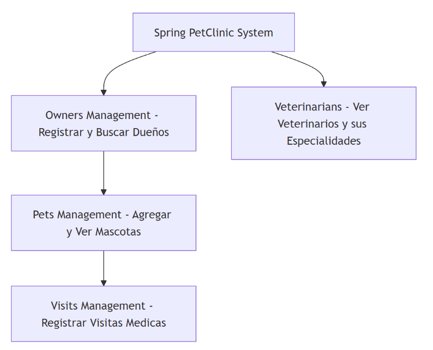

# Context Map - AI-Driven Discovery

El Context Map muestra de forma general cómo está organizado el sistema Spring PetClinic. Este permite registrar y buscar a los dueños de mascotas, ya que este es el punto de inicio para poder manejar la información dentro del sistema. A partir de cada dueño, se pueden agregar y visualizar sus mascotas.

Cada mascota puede tener varias visitas médicas registradas, las cuales sirven para llevar un control básico de las consultas. Además, el sistema cuenta con un apartado para ver a los veterinarios y sus especialidades. La sección de veterinarios se maneja de forma separada, ya que en el sistema no se asigna un veterinario específico a cada visita médica.

